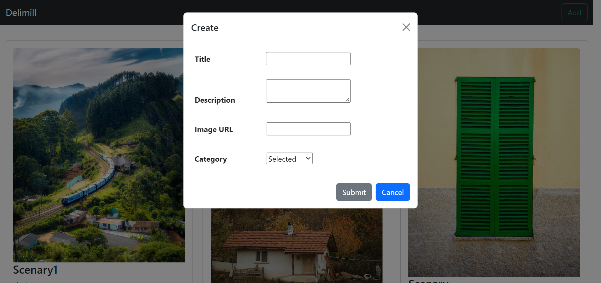
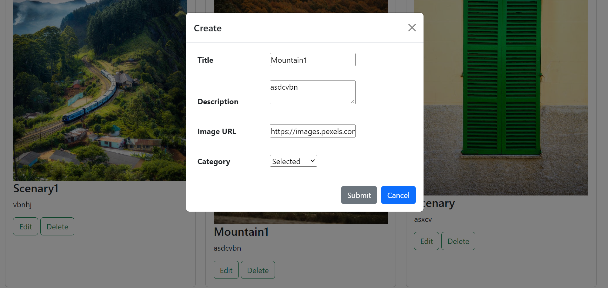
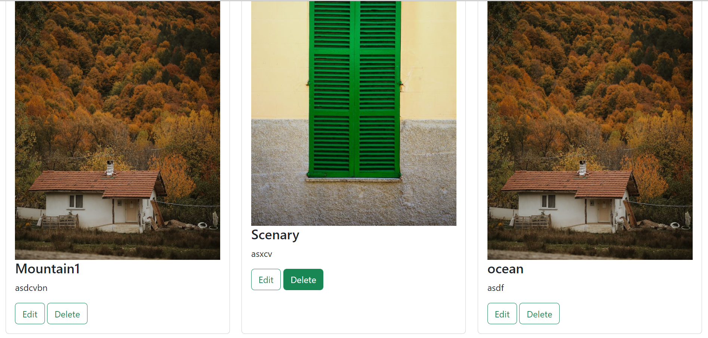

# **CRUD APP USING API**

It's a gallery based project where images comes from backened using api. We can add images by add button, if we want to change title, description, image URL we can edit it using edit button. We can also delete particular card by delete button.

### ADD IMAGE

### EDIT IMAGE

### DELETE IMAGE
click on delete button

## Trainer Target
- CRUD operations
- API 
- Bootstrap 

## Trainee Achieved
- having knowledge of Bootstrap 
- Learned on working in CRUD operations
- knowledge of using API

## Tech stack
### _Language_ : HTML, CSS, Javascript

